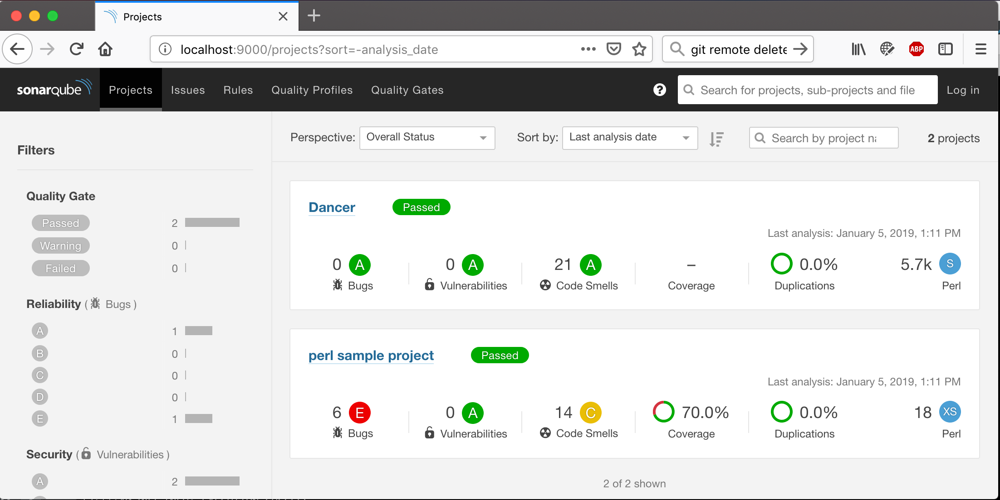
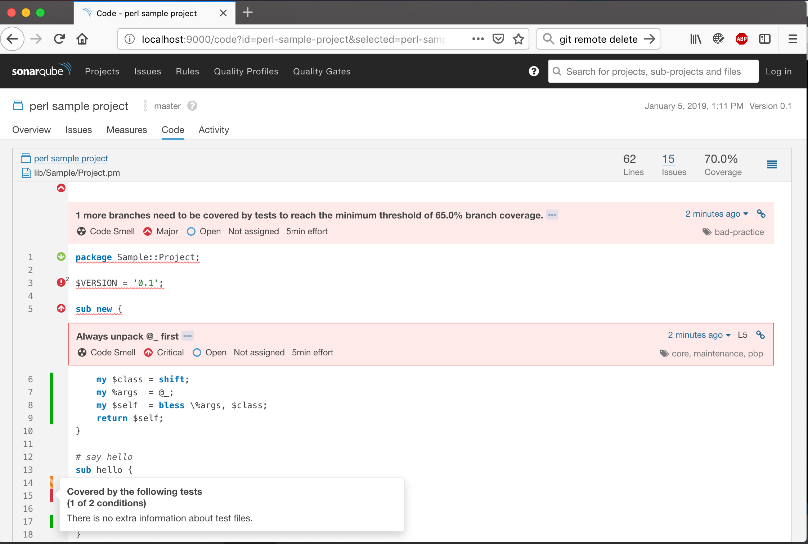
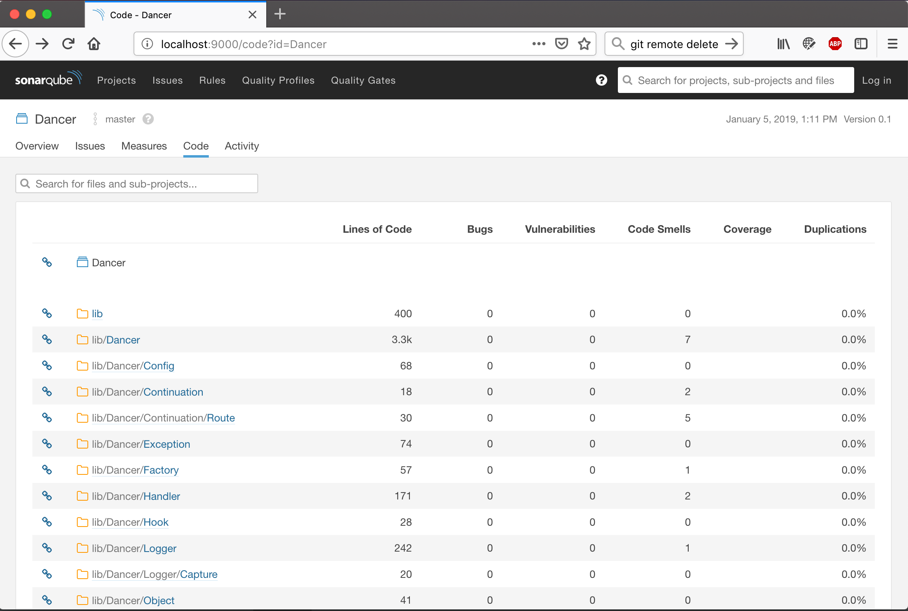
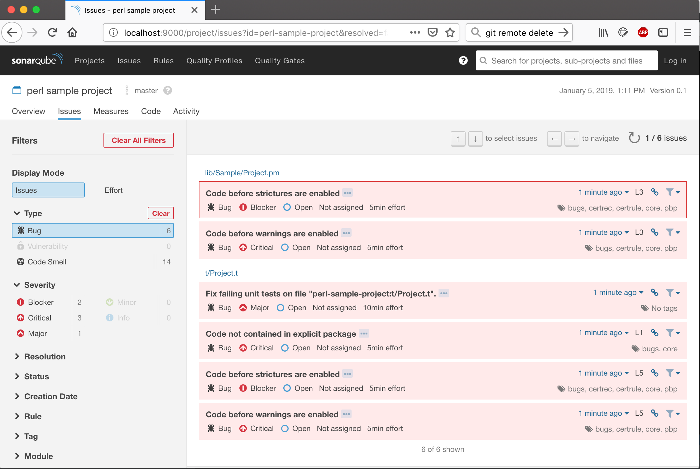
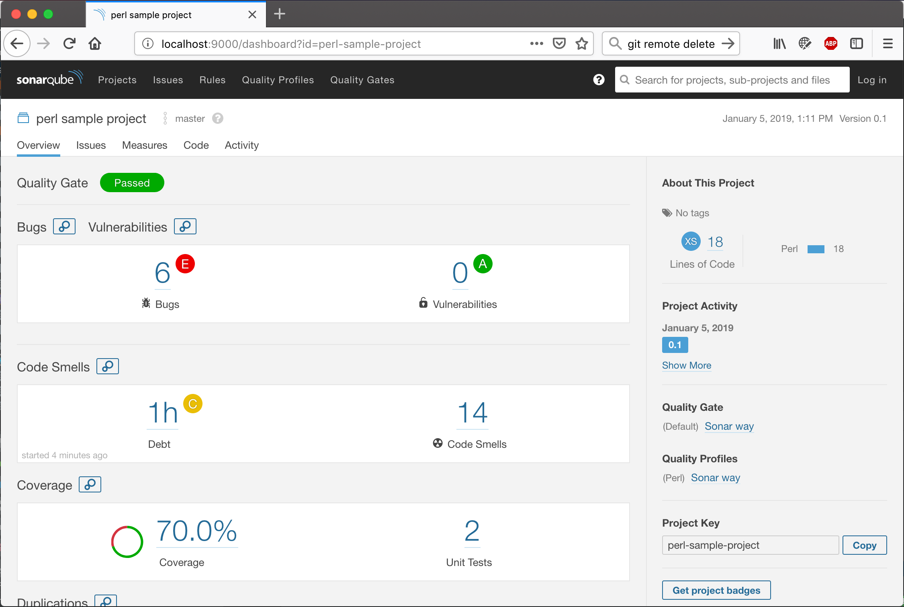
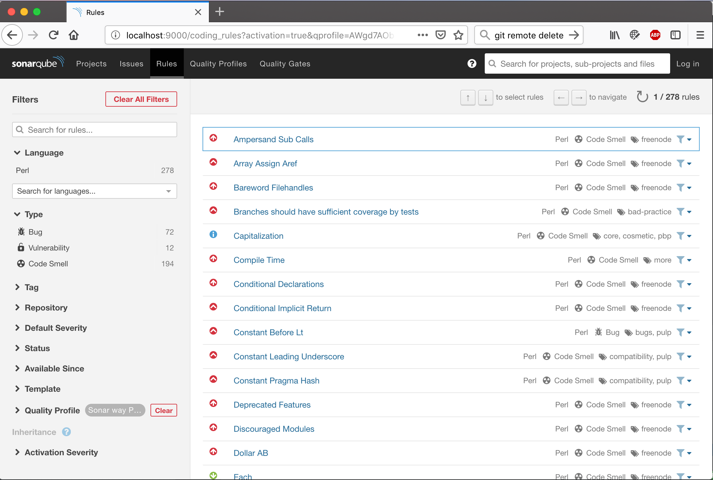
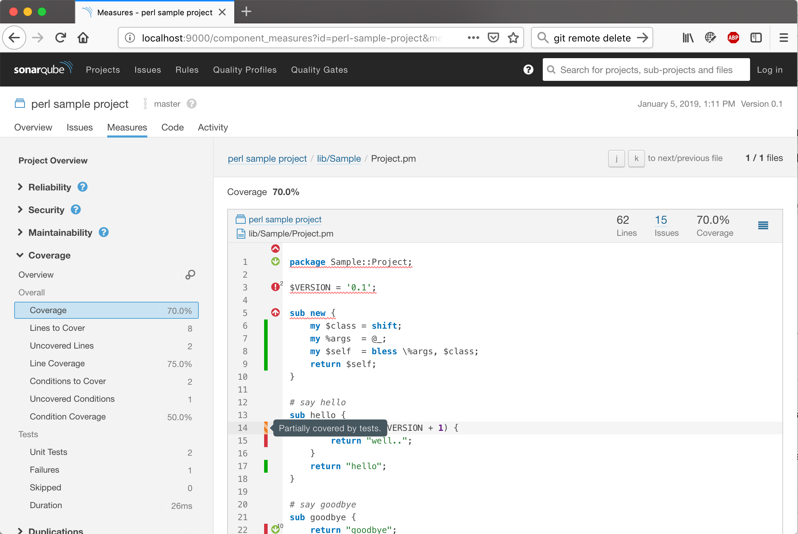

[](https://microbadger.com/images/sonarperl/sonar-perl "Get your own version badge on microbadger.com")
[](https://travis-ci.org/sonar-perl/sonar-perl)
[](https://sonarcloud.io/dashboard?id=sonar-perl_sonar-perl)
[](https://sonarcloud.io/dashboard?id=sonar-perl_sonar-perl)


# Perl 5 Plugin for SonarQube

This is a [SonarQube](http://www.sonarqube.org/) [plugin](http://docs.sonarqube.org/display/PLUG/Plugin+Library) 
to integrate popular features like code coverage, Perl::Critic and test reporting for your Perl 5 projects.

## Current State

Current plugin is still at an early stage. It analyzes Perl projects
without fully parsing the Perl code itself, attaching the source as
line-based text. There is work in progress on a grammar-based
parsing and analyzing (as far as this is possible for Perl, see bugtracker 
for current status).

What we have so far...

* LOC reporting (incl. comment and POD lines)
* Structural metrics (classes and functions)
* Test metrics (duration, successful and failed test count)
* Syntax highlighting of imported code
* Attaching of Perl::Critic issues
* Default profile containing 271 Perl::Critic rules
* Test Coverage (via Devel::Cover::Report::Clover)

## Screenshots

### Dashboard



### Source Code Details



### Code Metrics



### Issues Overview



### Project Overview



### Perl::Critic Rules Catalog



### Code Coverage




## Running it

The easiest way to see SonarQube with the Perl Plugin in action is to 
execute our sample Perl project with `sonar-scanner` against
a local SonarQube installation using `docker-compose`.

First, start up the SonarQube docker container, that has the
latest sonar-perl release installed.

```sh
docker-compose up -d sonarperl
```

Alternatively, you can build and run sonar-perl from source:

```sh
./gradlew run
```

Wait for SonarQube to start-up and then open the web interface in your browser
(http://localhost:9000/ - or the IP you bound your docker to).
Then, run the `sonar-scanner` on the sample project. For a more complex project reference, run the same commands on the dancer project.

```sh
docker-compose build sample dancer
docker-compose run sample 
docker-compose run dancer
```

You should see a "perl sample project" and "Dancer" on your SonarQube dashboard.


## Installing into your SonarQube

Plugin releases can be downloaded from our [github releases page](https://github.com/sonar-perl/sonar-perl/releases). 
If you want to build a snapshot version from source, you can create it via `./gradlew sonar-perl-plugin:jar` and
copy the resulting file (usually suffixed -SNAPSHOT, unless you checked out a release tag) 
e.g. `sonar-perl-plugin/build/libs/sonar-perl-plugin-0.4.3-SNAPSHOT.jar` into the plugins
directory of your SonarQube installation (should be something like `/opt/sonarqube/extensions/plugins/`)


## Analyzing your Perl project

- Make sure your SonarQube is running, and has the [latest perl plugin](https://github.com/sonar-perl/sonar-perl/releases) installed
- [Download](http://docs.sonarqube.org/display/SCAN/Analyzing+with+SonarQube+Scanner) and extract the `sonar-scanner` command-line tool.
- Create a basic `sonar-project.properties` file. Here is an example:

```
# must be unique in a given SonarQube instance
sonar.projectKey=My::Project
# this is the name displayed in the SonarQube UI
sonar.projectName=My Project
sonar.projectVersion=1.0.0
 
# Path is relative to the sonar-project.properties file. Replace "\" by "/" on Windows.
# Since SonarQube 4.2, this property is optional if sonar.modules is set. 
# If not set, SonarQube starts looking for source code from the directory containing 
# the sonar-project.properties file.
sonar.sources=lib
 
# Encoding of the source code. Default is default system encoding
sonar.sourceEncoding=UTF-8

sonar.tests=t
# testReport.tgz is the default for the report archive.
sonar.perl.testHarness.archivePath=testReport.tgz

## if your project has perl files without file extension:
# sonar.import_unknown_files=true
## .. and then exclude all known non-perl files.
# sonar.exclusions=READ*,Change*,COPY*,AUTH*,perlcritic_report.txt
```

- Execute your tests and save the report as `testReport.tgz`. We require a format compatible with `TAP::Harness::Archive`.

```sh
prove -t -a testReport.tgz
```

We also support JUnit reports. There are mainly two CPAN modules that can
generate JUnit XML reports, `TAP::Harness::JUnit` and `TAP::Formatter::JUnit`.
As the plugin would need to extract the test file names from the reports,
some specific settings are required when using these JUnit modules.

For `TAP::Harness::JUnit` you can generate a single report file. The namemangle
mode has to be "perl" or "none" to allow test file names to be recovered
from the JUnit report. Note that with the "perl" mode you shall not have
multiple dots in your test file name, like `foo.bar.t`. And the "none" mode
may not work well with some JUnit XML report consumer software.

```sh
# below would defaultly generate a junit_output.xml
JUNIT_NAME_MANGLE=perl prove --harness TAP::Harness::JUnit ...
```
```            
# in sonar-project.properties
sonar.perl.testHarness.junitPath=junit_output.xml
```

For `TAP::Formatter::JUnit`
```sh
# generate individual JUnit XML files into a directory
mkdir junit_output
PERL_TEST_HARNESS_DUMP_TAP=junit_output prove --formatter TAP::Formatter::JUnit --timer ...
```
```            
# in sonar-project.properties
sonar.perl.testHarness.junitPath=junit_output
```

The plugin would firstly try to scan `testReport.tgz`, or whatever specified via
`sonar.perl.testHarness.archivePath`. Only if the archive report does not exist,
it would look at the JUnit settings.

- Generate coverage reports in Clover-format (requires version 1.01 or later of `Devel::Cover::Report::Clover`)

```sh
cover -test -report clover
```

- Execute `Perl::Critic` and save the report as `perlcritic_report.txt` in your project. Important is the formatting
instruction below, to make the `perlcritic_report.txt` machine-readable.

```sh
perlcritic --cruel --quiet --verbose "%f~|~%s~|~%l~|~%c~|~%m~|~%e~|~%p~||~%n" lib t > perlcritic_report.txt
```

- Run the `sonar-scanner` 
- Finally open the project report in SonarQube

### Compatibility and known issues

We support the all SonarQube versions from 6.7 (LTS). Please report bugs
or incompatibilities in our [bugtracker](https://github.com/sonar-perl/sonar-perl/issues).

For older SonarQube versions (5.6+) stick with plugin version 0.3.2 or older.

Projects with mixed file encodings are currently not supported.

## Building the plugin from source

Running a full build includes creation of the plugin-jar and a docker image.
This is achieved by running `./gradlew build`. Note that you 
need to have a local docker daemon running for this.

## Performing a release

We're using the `axion` plugin for standardising the release process. To craft a new release, we tag the latest master, and let TravisCI push the resulting build artifacts to our Github releases page, and to docker hub.

You can start this process by calling:

```
./gradlew release
```

In case the build doesn't succed, you should remove the tag from github, fix the issues in `master`, and release again. But, if unsure, increment and release a new version.

Further details can be read on the [axion read-the-docs](https://axion-release-plugin.readthedocs.io/en/latest/) page.

## Next steps

Please look at the issues in our [bugtracker](https://github.com/sonar-perl/sonar-perl/issues) for
the planning and status of the next steps. We also appreciate contributions from the community.
So, if you're interested, get in touch with us!


## Links

* [Devel::Cover::Report::Clover](https://metacpan.org/pod/Devel::Cover::Report::Clover) ([source](https://github.com/captin411/devel-cover-report-clover/)) 1.01+ for coverage details. Please install [Sonar Clover Plugin](http://docs.sonarqube.org/display/SONARQUBE45/Clover+Plugin) for reading the coverage report.
* Perl [TAP](https://testanything.org/), and [TAP::Harness::Archive](https://metacpan.org/pod/TAP::Harness::Archive), [TAP::Harness::JUnit](https://metacpan.org/pod/TAP::Harness::JUnit), [TAP::Formatter::JUnit](https://metacpan.org/pod/TAP::Formatter::JUnit), for test reporting.
* [Perl::Critic](http://perlcritic.org/) for issue reporting.

